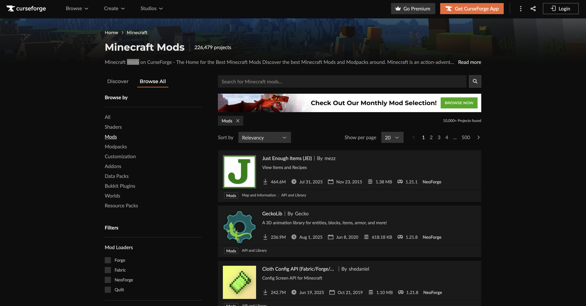

# CurseForge Scraper

Asynchronous, fault-tolerant web scraper for CurseForge Minecraft mods, collecting structured metadata: mod name, slug, authors, categories, supported game versions, release history, download counts, ratings, dependencies, and file links.
Designed as a resilient async pipeline with deduplication, throttling, exponential backoff retries, field normalization, and clean CSV output. Suitable for long-running incremental data collection, reproducible restarts, and downstream analytics.

  
Source: www.curseforge.com

